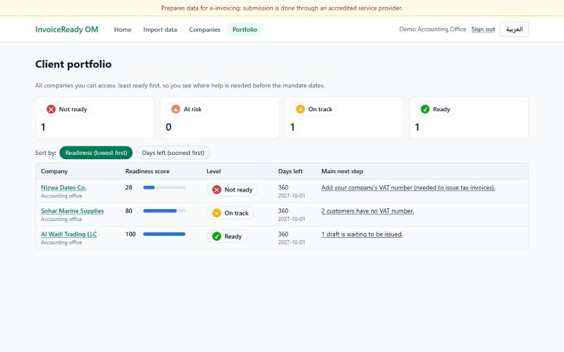
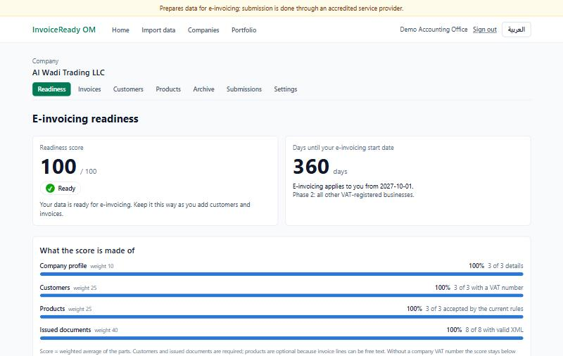
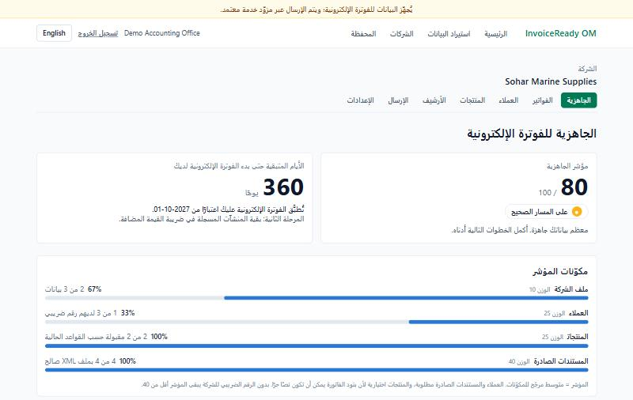
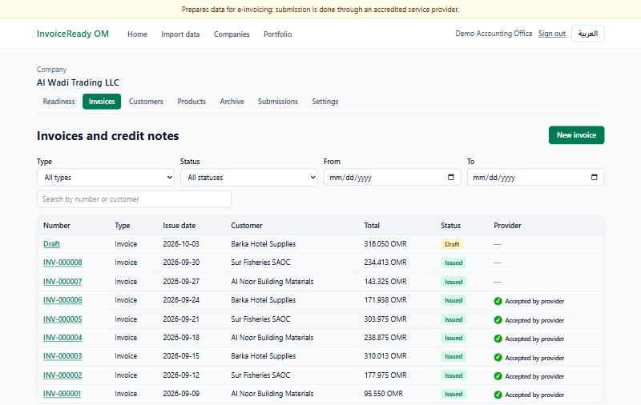
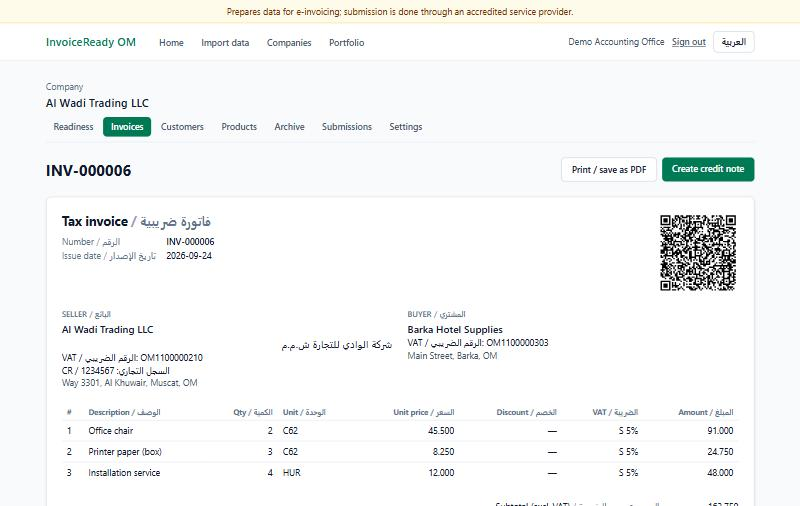
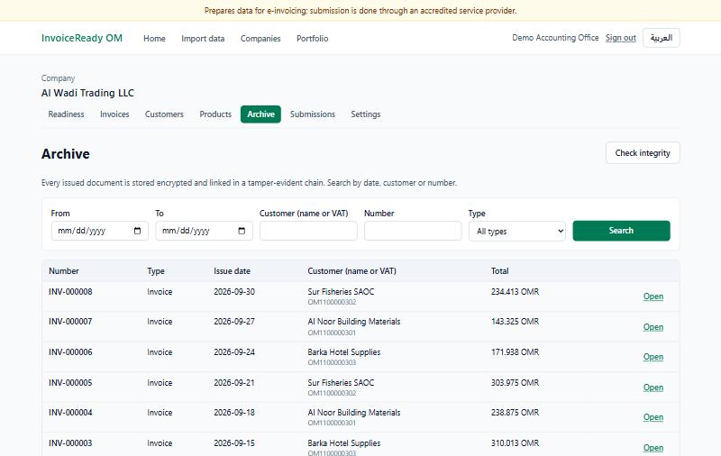
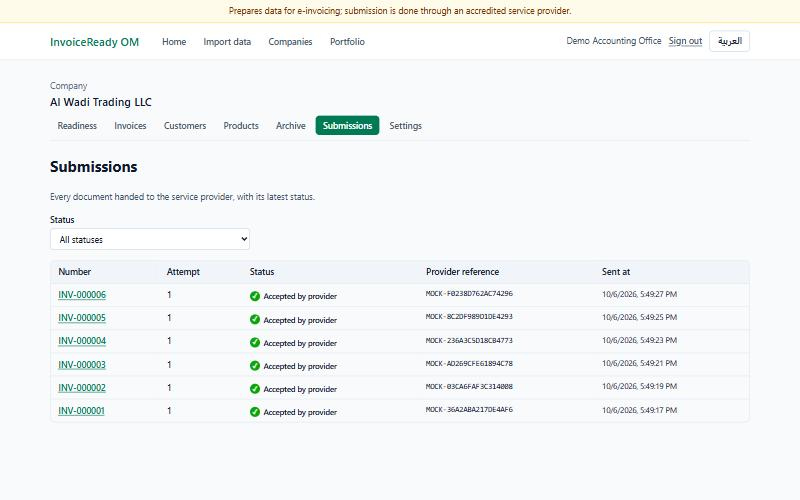

# InvoiceReady OM

**A bilingual (English / Arabic) web platform that helps small businesses and accounting offices in
Oman get their invoice data ready for the national e-invoicing mandate (Fawtara).**

Designed and built by **Safa Alshukaili** · 2025–2026

> 🔒 **This repository is a showcase only.** InvoiceReady OM is a commercial product; its source
> code, database design and documentation are private. A live demo or a technical walkthrough is
> available to employers on request.

---

## The problem

Oman's e-invoicing mandate applies to large businesses from **1 April 2027** and to all other
VAT-registered businesses from **1 October 2027**. Most small businesses keep invoices in Excel
sheets with mixed Arabic/English headers, missing VAT numbers, inconsistent dates and units.
Accounting offices that serve dozens of such clients have no simple way to see who is ready and
what each client still has to fix.

## What I built

An end-to-end platform, from messy spreadsheets to structured e-invoices handed to an accredited
service provider:

| Area | What it does |
|---|---|
| **Data import & cleaning** | Reads Excel/CSV files, recognises Arabic and English column names, fixes what is safe to fix (Arabic-Indic digits, VAT format, units, dates), and reports every remaining issue by row, field and suggested fix, in both languages. |
| **Invoicing** | Customer and product registers, tax invoices and credit notes with exact VAT arithmetic (rounded to the baisa), gap-free numbering on issue, QR code and a bilingual printable layout. |
| **Structured XML** | Generates UBL 2.1 / Peppol BIS 3.0 XML for every issued document and validates it against EN 16931 and Peppol business rules, with schema (XSD) validation ready for the official Omani specification. |
| **Tamper-evident archive** | Every issued document is encrypted and linked in a hash chain; an integrity check detects any alteration. Encryption keys can be rotated without downtime. |
| **Readiness dashboard** | A 0–100 readiness score per company, a countdown to the company's mandate date, next steps that link straight to the records to fix, and monthly trend charts. |
| **Accounting-office portfolio** | One view of all client companies, least ready first, so an office knows where to spend its time before the deadlines. |
| **Service-provider connector** | A replaceable connector interface with a simulated provider (accept / reject / outage), a submission log with timelines and rejection reasons, and protection against sending a document twice. |
| **Roles & security** | Owner, accountant and accounting-office roles; Argon2id password hashing, signed tokens, sign-in throttling, and production settings that refuse to start with weak secrets. |

## Screenshots

*All data shown is synthetic: the companies, people and numbers are fictional.*

**Accounting-office portfolio:** every client company, least ready first.

**Readiness dashboard:** score, mandate countdown and what the score is made of.

**Full Arabic interface (right-to-left).**

**Invoices and credit notes** with status and provider result.

**Bilingual tax invoice** with QR code.

**Encrypted, tamper-evident archive** with an integrity check.

**Submission log** (simulated service provider).

## Technology

- **Backend:** Python, FastAPI, SQLAlchemy 2, Alembic, Pydantic v2, PostgreSQL
- **Frontend:** React, TypeScript, Vite, Tailwind CSS, TanStack Query, react-i18next (EN/AR, RTL)
- **Data & documents:** openpyxl, pandas, lxml (UBL 2.1 XML and schema validation), qrcode
- **Security:** Argon2id, JWT, Fernet encryption with key rotation, hash-chained archive
- **Delivery:** Docker Compose, Caddy (automatic HTTPS), GitHub Actions CI

## Engineering quality

- **430+ automated backend tests, about 99% code coverage**; 50+ frontend tests.
- CI runs linting, type checks, all tests, and an **end-to-end test of every feature on
  PostgreSQL** inside Docker on each change.
- Money handled as exact decimals with a single rounding rule; tax rules kept in one place.
- Architecture decisions and every assumption about Omani requirements are documented.
- Bilingual by design: every screen, message and validation report in English and Arabic.

## My role

I did everything on this project myself: product idea and market research, requirements,
architecture, backend and frontend development, the test strategy, security design, deployment,
and documentation.

## Important note

InvoiceReady OM **prepares** data for e-invoicing. It is not an accredited service provider and
does not connect to the Tax Authority; submission is done through an accredited provider.

## Contact

**Safa Alshukaili** · GitHub: [@Safa-Alshukaili](https://github.com/Safa-Alshukaili)

---

## نبذة بالعربية

**InvoiceReady OM** منصة ويب ثنائية اللغة صمّمتُها وطوّرتُها بالكامل لمساعدة المنشآت الصغيرة
ومكاتب المحاسبة في سلطنة عُمان على تجهيز بيانات فواتيرها لنظام الفوترة الإلكترونية الإلزامي
(فوترة): استيراد ملفات Excel وتنقيتها، وإصدار فواتير ضريبية ثنائية اللغة، وإنشاء ملفات XML
بصيغة UBL 2.1، وأرشيف مشفّر يكشف أي تلاعب، ولوحة جاهزية لكل منشأة، ومحفظة لمكاتب المحاسبة،
وربط قابل للاستبدال مع مزوّد خدمة معتمد.

> 🔒 هذا المستودع للعرض فقط. المشروع تجاري، والشيفرة المصدرية وتصميم قاعدة البيانات والتوثيق
> خاصة وغير منشورة. يمكن ترتيب عرض مباشر لأصحاب العمل عند الطلب.

---

© 2025–2026 Safa Alshukaili. All rights reserved. See [LICENSE](LICENSE).
The screenshots, text and the InvoiceReady OM name may not be copied or reused without written
permission.
